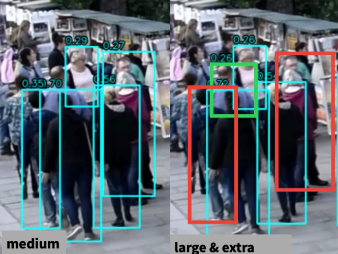
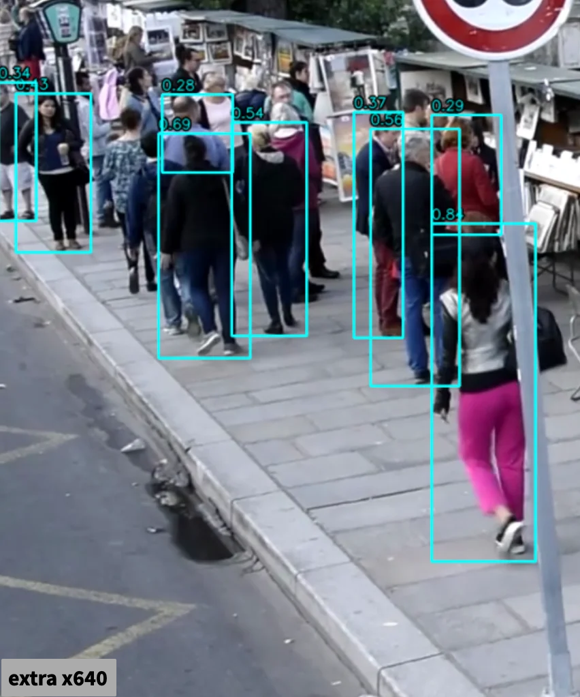
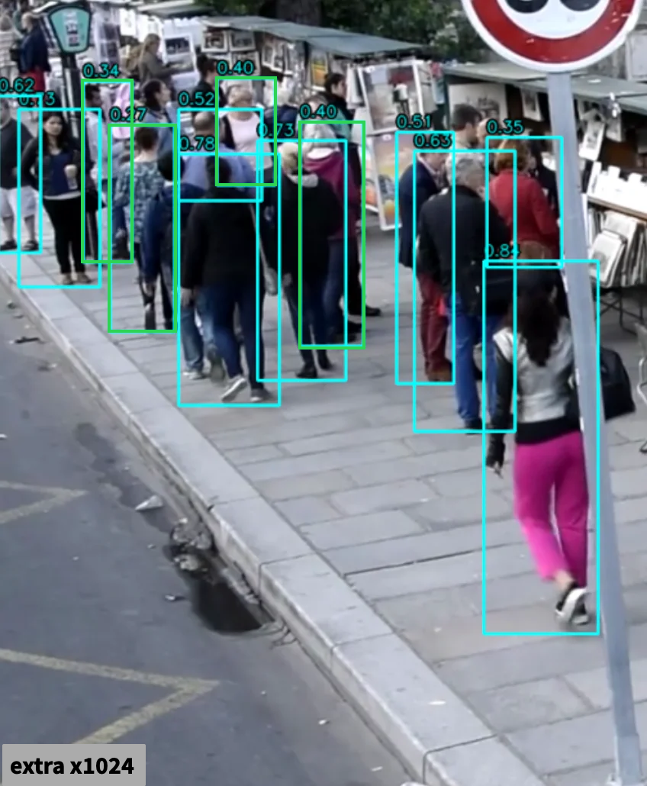
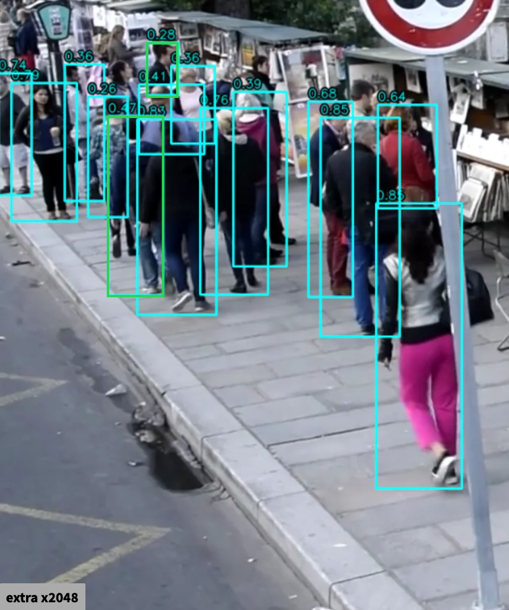
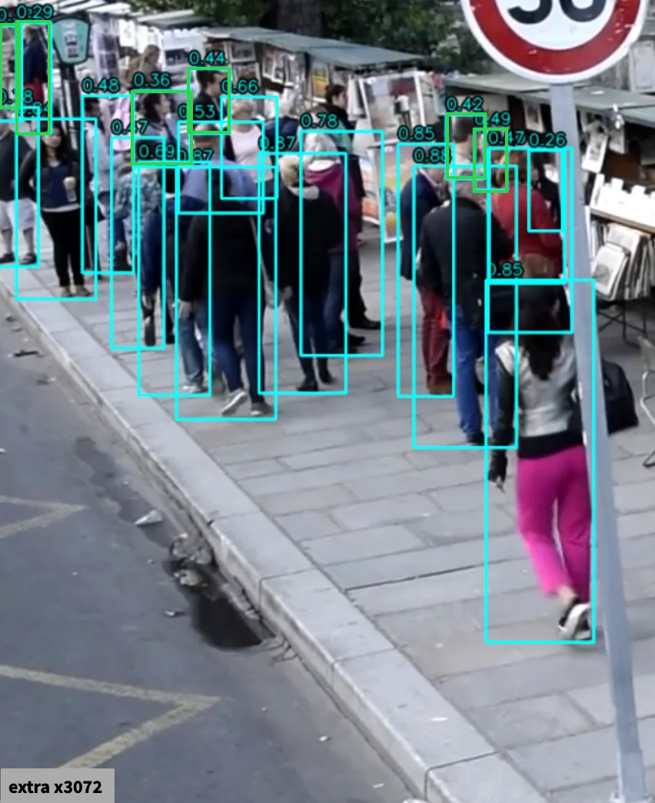
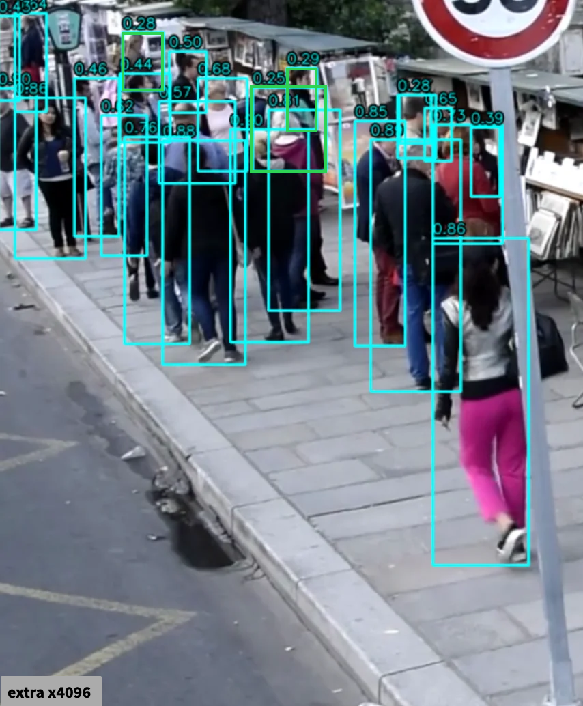

# Детекция людей на видео (YOLOv8)

# Архитектура проекта
```
project/
│
├── data/          # видео для обработки
│   └── crowd.mp4
│
├── results/       # видео после детекции
│   ├── output.mp4
│
├── images/        # изображения для README
│   └── ...
│
├── detector.py    # загрузка модели и detect_people
├── drawing.py     # отрисовка боксов
├── utils.py       # чтение и запись видео, присвоение имени файлам
├── main.py        # точка входа
├── README.md
└── requirements.txt
```

# Запуск

1. склонировать репозиторий 
```git clone <https://github.com/Just-Alexandr/BND-LLC-crowd-detection>```

2. установить зависимости
```pip install -r requirements.txt```

3. поместить входной файл (.mp4) в 'data/' и переименовать в 'crowd' (data/crowd.mp4)

4. запустить основной скрипт ```python main.py```

5. результат появится в results/

---
# Решение
### возьмем **YOLOv8**
### переберем все вариации модели (от nano до extra)


### nano и small версии показывают неплохой результат, однако модель абсолютно не видит людей на заднем плане и пропускает значительную часть на переднем

---


### **medium** - первая модель которая замечает всех людей на переднем плане (даже смогла обнаружить одного на заднем плане), однако все равно большие проблемы с левым верхним углом, где люди достаточно крупные


---
### модели **large & extra** практически не привносят улучшений (в некоторых моментах, как показано на картинке, работают даже хуже), однако для дальнейшего улучшения будем использовать имненно их (позже объяснение)



---


### по умолчанию YOLOv8 работает с изображениями размеров 640x640, из-за чего могут не улавливаться особенно мелкие детали (как задний фон или пересечение нескольких людей)
### увеличивая размер изображения замечаем, что модель все лучше разделяет вплотную стоящих людей и задний план в целом (каждый человек получает больше пиксельной площади, больше пикселей - больше признаков, которые может извлечь модель)

### несмотря на то что medium показала себя лучше в стандартном виде, при увеличении размеров изображения достаточно быстро начинают появляться артефакты (дублироваться боксы)


### extra же в свою очередь сталкивается с данной проблемой значительно позже, что позволяет улучшить ее качество сильнее
### пробуем увеличить размер входного изображения с 640 на 1024, 2048, 3072 и 4096
















### несмотря на то что каждое увеличение изображения приводит к улучшению детекции, при размере > 3072 начинают появляться артефакты (дублирование боксов), что особенно заметно на видео из-за постоянного мелькания


### таким образом с помощью одного лишь увеличения изображения на входе добиваемся приемлемого результата (оставляем 3072, который немного хуже 4096, но без артефактов)

---

# Дальнейшие улучшения
### **tiled inference:** каждый кадр делим на несколько частей, которые по отдельности пропускаем через модель и склеиваем на выходе (необходимо будет правильно обрабатывать стыки, вероятно настраивать пересечение)
### **upscaling:** улучшаем качество картинок (частей после деления) перед поступлением на вход модели
### **fine-tuning:** в случае если предыдущие шаги не дали желаемого качества, попробовать разметить какое-то количество картинок толпы и дообучить модель на них